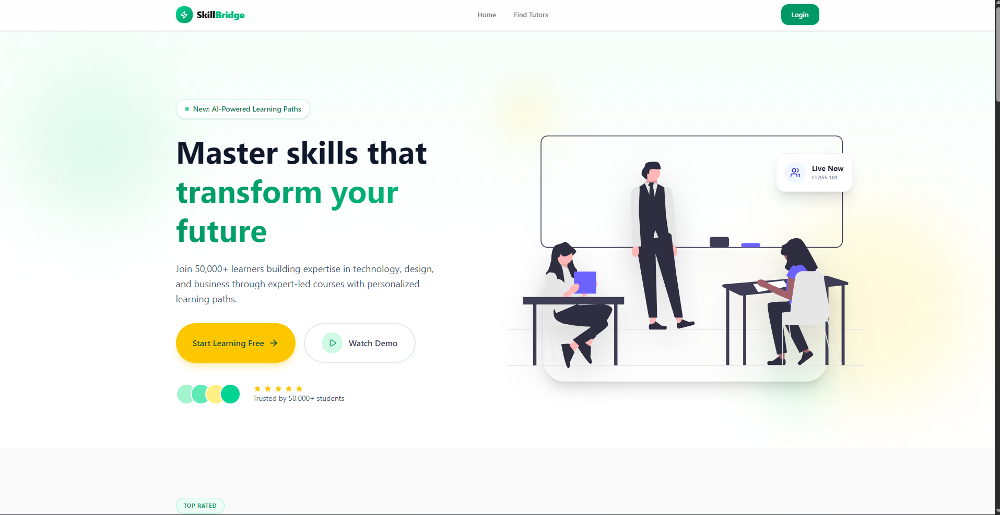

# SkillBridge — Tutor Marketplace Platform

> A modern full-stack tutor marketplace that connects students with verified tutors through a seamless discovery, booking, and learning experience.

[](https://skill-bridge-client-mauve.vercel.app/)



---

## Table of Contents

- [About the Project](#about-the-project)
- [Project Overview](#project-overview)
- [Highlights](#highlights)
- [Key Features](#key-features)
- [User Roles](#user-roles)
- [Tech Stack](#tech-stack)
- [Getting Started](#getting-started)
- [Project Structure](#project-structure)
- [Contact](#contact)

---

## About the Project

**SkillBridge** is a modern tutor marketplace platform designed to simplify how students discover, evaluate, and connect with professional tutors. It provides an intuitive learning ecosystem where students can browse tutor profiles, book personalized learning sessions, and track their learning journey through a secure dashboard.

Tutors can build professional profiles, manage their availability, receive booking requests, and showcase their expertise. Administrators oversee platform operations by managing users, tutor categories, bookings, and overall system activity.

Built with a scalable architecture using Next.js, Express.js, PostgreSQL, Prisma ORM, and Better Auth, SkillBridge focuses on security, performance, and an excellent user experience.

---

## Project Overview

| Area | Description |
|------|-------------|
| **Objective** | Build a secure marketplace connecting students with verified tutors. |
| **Target Users** | Students, Tutors, and Platform Administrators. |
| **Authentication** | Better Auth with Email Verification, Google OAuth, and GitHub OAuth. |
| **Authorization** | Role-Based Access Control (RBAC). |
| **Architecture** | Full-stack application powered by REST APIs and PostgreSQL. |
| **Deployment** | Frontend deployed on Vercel. |

---

## Highlights

- Secure authentication with Better Auth
- Email verification & social authentication
- Tutor discovery with advanced filtering
- Tutor profile and availability management
- Session booking workflow
- Review and rating system
- Role-based dashboards
- Admin management panel
- Responsive modern UI
- RESTful API architecture

---

## Key Features

### Authentication & Security

- Secure authentication with Better Auth.
- Email verification.
- Google and GitHub OAuth.
- Protected routes with role-based authorization.
- Secure session management.

---

### Tutor Marketplace

Students can easily discover the right tutor based on their learning goals.

- Browse verified tutors.
- Search tutors by skills, languages, or expertise.
- Advanced filtering and sorting.
- Detailed tutor profiles.
- Availability overview.

---

### Booking Management

A streamlined workflow for scheduling learning sessions.

- Tutor session requests.
- Booking status management.
- Student booking history.
- Personalized booking messages.
- Session tracking.

---

### Reviews & Ratings

Students can share learning experiences after completed sessions.

- Tutor rating system.
- Student reviews.
- Public tutor feedback.
- Reputation building.

---

### Role-Based Dashboards

Dedicated dashboards for every platform user.

- Student Dashboard
- Tutor Dashboard
- Admin Dashboard
- Profile management
- Personalized navigation

---

### Administration

Complete platform management tools.

- User management.
- Tutor category management.
- Booking administration.
- Platform analytics.
- Dashboard overview.

---

### Modern User Experience

- Fully responsive design.
- Interactive landing page.
- Clean and intuitive interface.
- Optimized performance.
- Reusable UI components.

---

## User Roles

| Role | Responsibilities |
|------|------------------|
| **Student** | Discover tutors, book sessions, manage bookings, and submit reviews. |
| **Tutor** | Manage profile, availability, bookings, and teaching information. |
| **Admin** | Manage users, categories, bookings, and overall platform operations. |

---

## Tech Stack

### Frontend

- Next.js
- React
- TypeScript
- Tailwind CSS
- shadcn/ui
- Radix UI

### Backend

- Node.js
- Express.js
- Prisma ORM
- PostgreSQL
- Better Auth

### Libraries

- TanStack Query
- Axios
- Zod
- React Hook Form
- Recharts
- Framer Motion
- Sonner

### Deployment

- Vercel

---

## Getting Started

### Prerequisites

- Node.js 20+
- npm
- Running SkillBridge Backend API

### Installation

Clone the repository

```bash
git clone https://github.com/Rahmot15/Skill-Bridge-client-B6A4-.git
cd Skill-Bridge-client-B6A4-
```

Install dependencies

```bash
npm install
```

Create a `.env.local` file

```env
NEXT_PUBLIC_SERVER_BASE_URL=http://localhost:5000
BACKEND_URL=http://localhost:5000
```

Run the development server

```bash
npm run dev
```

Open your browser

```text
http://localhost:3000
```

---

## Project Structure

```text
skill-bridge-client/
│
├── src/
│   ├── app/
│   ├── components/
│   ├── hooks/
│   ├── lib/
│   ├── services/
│   ├── constants/
│   └── types/
├── public/
├── proxy.ts
└── next.config.ts
```

---

## Contact

**🌐 Live Demo:** https://skill-bridge-client-mauve.vercel.app/

**👨‍💻 Developer:** Rahmatullah

**📧 Email:** mdrahmatulla666@gmail.com

**🐙 GitHub:** https://github.com/Rahmot15
